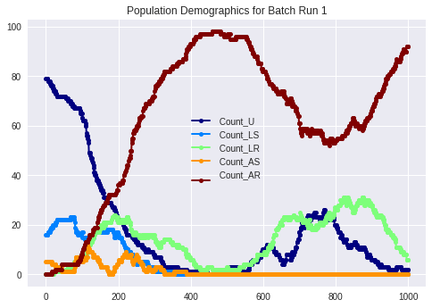
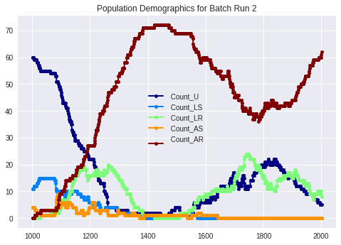

# Agent-Based-Modeling-And-Simulation-of-Drug-Resistant-Diseases

This agent-based model was developed to study the onset of drug resistance in Mycobacterium tuberculosis.
The model uses RepastCity to simulate human movements on GIS-based urban enviroments and simulates subsequent spread of the disease.
Our model was able to implicate interesting findings such as differences between drug-resistant and drug-susceptible diseases.

Refer the [Report](https://github.com/Charan000/Agent-Based-Modeling-And-Simulation-of-Drug-Resistant-Diseases/blob/master/Report.pdf) for additional details.

Infection Model:  

City Model:  

Result of Simulation of 1000 years with 100 human agents:

Result of Simulation of 2000 years with 100 human agents:

